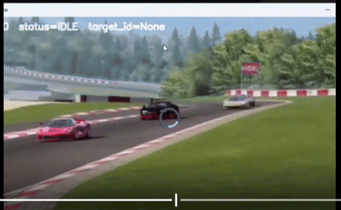

# Chayan | scienstien

<table>
  <tr>
    <td width="55%" valign="top">
      <h3>Full-stack engineer building AI-powered web apps, computer vision systems, and physics simulations.</h3>
      
I like projects where the hard part is not just writing code, but making a technical system feel usable: a model that responds in real time, a simulation you can interact with, or an engineering workflow that becomes a clean web tool.

      
<strong>Current lane:</strong> WebDev + ML/CV + aerospace software, with C++, Python, OpenCV, SFML, React, Next.js, FastAPI, and SQL.

    </td>
    <td width="45%" align="center" valign="middle">
      
       
      BlurGoBrr: click-to-track autofocus with background blur
    </td>
  </tr>
</table>

## Featured Build: BlurGoBrr

[BlurGoBrr](https://github.com/scienstien/BlurGoBrr) is an AI-based smart autofocus and dynamic subject tracking system. The user selects an object in a video, the system keeps that object sharp across frames, and the background gets a cinematic blur.

- Computer vision pipeline with YOLOv8-style detection/segmentation, ByteTrack-style identity tracking, and mask-based compositing
- Real-time interaction model: click to select, maintain target identity, switch focus, preview, render, download
- Python backend with FastAPI-style API structure and OpenCV processing
- Frontend flow for upload, frame preview, target selection, playback, and output rendering

## What I Build

| Area | What I care about |
| --- | --- |
| Full-stack web apps | React, Next.js, TypeScript, Python APIs, auth, SQL-backed products, and interfaces that feel crisp. |
| Computer vision + ML | YOLO/CNN workflows, OpenCV, local inference, tracking, segmentation, and real-time pipelines. |
| Simulation + aerospace | C++/Python systems, SFML visualizations, numerical methods, turbomachinery, propulsion, and physics-heavy tools. |
| Product engineering | Turning messy prototypes into usable systems with readable structure, clear flows, and testable behavior. |

## Selected Projects

| Project | Signal |
| --- | --- |
| [BlurGoBrr](https://github.com/scienstien/BlurGoBrr) | Smart autofocus, object tracking, segmentation blur, video-processing UI. |
| [Orbit Website 26](https://github.com/scienstien/orbit-website-26) | Next.js App Router, React 19, TypeScript, Tailwind, Prisma/Postgres, auth, Zod. |
| [Nano Website](https://github.com/scienstien/Nano_website) | React + Vite frontend with Three.js, React Three Fiber, Drei, Framer Motion, and interactive UI. |
| [BladeLab](https://github.com/scienstien/BladeLab) | Physics-driven turbomachinery design environment with Flask, FastAPI, tests, Docker, and OpenEnv-style endpoints. |
| [SchwarzschildGeodesics](https://github.com/scienstien/SchwarzschildGeodesics) | C++/SFML visualization of null geodesics around a Schwarzschild black hole. |
| [Rag-Application](https://github.com/scienstien/Rag-Application) | Streamlit and LangChain RAG app experimenting with local and cloud retrieval pipelines. |

## Tooling I Reach For

  
  
  
  
  
  
  
  
  
  
  

- Frontend: React, Next.js, TypeScript, Vite, Tailwind, Framer Motion, Three.js
- Backend: FastAPI, Django, Python APIs, WebSockets, auth flows, SQL-backed apps
- CV/ML: OpenCV, YOLO/CNNs, PyTorch, ONNX Runtime, tracking, segmentation, RAG
- Engineering: C++, Python, SFML, numerical methods, CAD, turbomachinery analysis

## Operating Principle

Build the thing until the hard idea becomes easy to touch. If the model is smart but the interface is bad, it is unfinished. If the physics is interesting but nobody can run it, it is unfinished. Ship the bridge between the idea and the user.

## Connect

- GitHub: [@scienstien](https://github.com/scienstien)